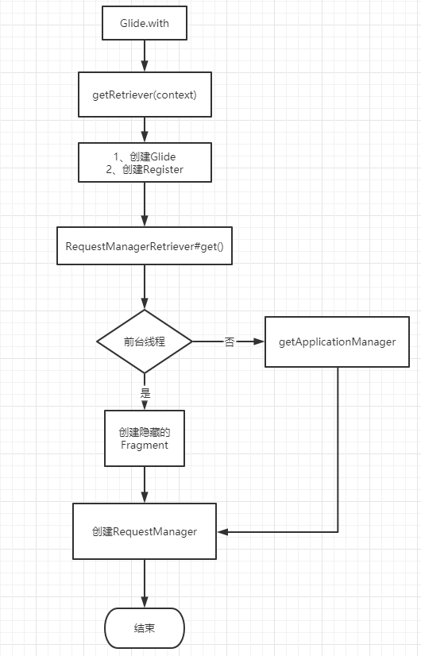

&ensp;&ensp;大家应该都听说过Glide图片加载库，或多或少都知道怎么去使用Glide去加载一张图片。Glide对于使用者来说是非常友好的一个库。那么今天我们就来学习Glide的源码，网上也有很有优秀的博客讲解Glide的源码的，现在我们一起来学习Glide的源码。这个优秀的框架是怎么帮助我们实现图片的加载和显示的。很多人看源码都不知道从哪里下手。这篇博客也分享一下我平时是怎么看源码的。<br>
&ensp;&ensp;首先我们平时是怎么使用Glide的？

```
Glide.with(context).load(url).into(iv);
```
这就是平时使用Glide的代码，那么看源码也很简单，就直接从这一段代码开始看，这段代码有三个部分，这三个部分分别是with，load和into。我们这个分析源码也一步一步分析这三个步骤。下面就来看看with，load，into分别做了什么。
#### `Glide.with(context)`
```java
//Glide#with(表示某个类的某个方法)
//注意这里返回值是RequestManager，为什么要注意这个，因为后面的load是基于这个返回值去调用的
  @NonNull
  public static RequestManager with(@NonNull Context context) {
    return getRetriever(context).get(context);
  }
```
我们点进去Glide的源码看一下，看with这个函数，它有很多重载函数，但是他们里面都有一个相同的步骤就是调用`getRetriever(context).get(context)`。

那么接下来继续跟下去，因为通过`getRetriever(context).get(context)`我们并不知道里面是什么，看源码的话，就是要知道这里面究竟做了什么。这个方法有两个调用，首先先看`getRetriever()`   

##### Glide#getRetriever

```java
// Glide#getRetriever
  @NonNull
  private static RequestManagerRetriever getRetriever(@Nullable Context context) {
    //做一下判空，真正有用的是下面那句
    Preconditions.checkNotNull(
        context,
        "You cannot start a load on a not yet attached View or a Fragment where getActivity() "
            + "returns null (which usually occurs when getActivity() is called before the Fragment "
            + "is attached or after the Fragment is destroyed).");
    //执行Glide.get(context).getRequestManagerRetriever()
    return Glide.get(context).getRequestManagerRetriever();
  }
```
这个方法也有两个调用，他里面真正重要的是 `Glide.get(context)`。因为`getRequestManagerRetriever()`只是返回一个`RequestManagerRetriever`而已。所以接下来我们要重点关注了就是`Glide.get(context)`

##### Glide#get(context)

```java
  @NonNull
  public static Glide get(@NonNull Context context) {
  //这里使用的是双重检查模式的单例模式去创建一个Glide的单例，所以接下来我们需要知道的就是怎么去创建Glide，以及这个过程中间做了什么
    if (glide == null) {
    //通过反射找到GeneratedAppGlideModuleImpl 类，如果能找到，就说明自定义了GlideModule，那么就需要实现自己的自定义功能。但是这个对于我们的影响并不大，我们可以忽略这个参数，因为我们分析源码整体流程Glide.with(context).load(url).into(iv);是没有使用到这一部分的
      GeneratedAppGlideModule annotationGeneratedModule =
          getAnnotationGeneratedGlideModules(context.getApplicationContext());
      synchronized (Glide.class) {
        if (glide == null) {
          checkAndInitializeGlide(context, annotationGeneratedModule);
        }
      }
    }

    return glide;
  }
  
  @GuardedBy("Glide.class")
  private static void checkAndInitializeGlide(
      @NonNull Context context, @Nullable GeneratedAppGlideModule generatedAppGlideModule) {

    if (isInitializing) {
      throw new IllegalStateException(
          "You cannot call Glide.get() in registerComponents(),"
              + " use the provided Glide instance instead");
    }
    isInitializing = true;
    initializeGlide(context, generatedAppGlideModule);
    isInitializing = false;
  }
  

  @GuardedBy("Glide.class")
  private static void initializeGlide(
      @NonNull Context context, @Nullable GeneratedAppGlideModule generatedAppGlideModule) {
    initializeGlide(context, new GlideBuilder(), generatedAppGlideModule);
  }
  
/**
  *这个方法代码看起来很多，但是我们只需要关注对我们有用的代码逻辑即可，
  *有人问了什么是有用的代码逻辑？现在我们回想一下我们跟进这一部分的源码的目的是什么？
  *是创建Glide单例对不对？所以我们重点关注这一块就好了。其他的代码逻辑是配置一些注解之后Glide的逻辑，所以目前我们不用管这部分逻辑，但是我还是会注释每一部分是做什么的
  */
    private static void initializeGlide(
      @NonNull Context context,
      @NonNull GlideBuilder builder,
      @Nullable GeneratedAppGlideModule annotationGeneratedModule) {
    Context applicationContext = context.getApplicationContext();
    List<com.bumptech.glide.module.GlideModule> manifestModules = Collections.emptyList();
    if (annotationGeneratedModule == null || annotationGeneratedModule.isManifestParsingEnabled()) {
    // 从AndroidManifest.xml 获取自定义的GlideModule（这是另外一种自定义GlideModule的方式）
      manifestModules = new ManifestParser(applicationContext).parse();
    }
// 根据Impl的黑名单，剔除manifest中的GlideModule类
    if (annotationGeneratedModule != null
        && !annotationGeneratedModule.getExcludedModuleClasses().isEmpty()) {
      Set<Class<?>> excludedModuleClasses = annotationGeneratedModule.getExcludedModuleClasses();
      Iterator<com.bumptech.glide.module.GlideModule> iterator = manifestModules.iterator();
      while (iterator.hasNext()) {
        com.bumptech.glide.module.GlideModule current = iterator.next();
        if (!excludedModuleClasses.contains(current.getClass())) {
          continue;
        }
        if (Log.isLoggable(TAG, Log.DEBUG)) {
          Log.d(TAG, "AppGlideModule excludes manifest GlideModule: " + current);
        }
        iterator.remove();
      }
    }

    if (Log.isLoggable(TAG, Log.DEBUG)) {
      for (com.bumptech.glide.module.GlideModule glideModule : manifestModules) {
        Log.d(TAG, "Discovered GlideModule from manifest: " + glideModule.getClass());
      }
    }
// 获取工厂，用于创建RequestManager（该工厂用于，如果with（）参数传递的是application）
    RequestManagerRetriever.RequestManagerFactory factory =
        annotationGeneratedModule != null
            ? annotationGeneratedModule.getRequestManagerFactory()
            : null;
    builder.setRequestManagerFactory(factory);
     //执行用户在 manifest 中配置的 GlideModule 接口中的方法
    for (com.bumptech.glide.module.GlideModule module : manifestModules) {
      module.applyOptions(applicationContext, builder);
    }
    //执行使用注解配置的GlideModule 接口中的方法
    if (annotationGeneratedModule != null) {
      annotationGeneratedModule.applyOptions(applicationContext, builder);
    }
    //创建Glide
    Glide glide = builder.build(applicationContext);
      //下面registerComponents 方法的执行，需要传递Registry对象，而该对象是在创建Glide 的时候，被赋值，并设置一系列的参数
        //执行用户在 manifest 中配置的 GlideModule 接口中的registerComponents 方法
    for (com.bumptech.glide.module.GlideModule module : manifestModules) {
      try {
        module.registerComponents(applicationContext, glide, glide.registry);
      } catch (AbstractMethodError e) {
        throw new IllegalStateException(
            "Attempting to register a Glide v3 module. If you see this, you or one of your"
                + " dependencies may be including Glide v3 even though you're using Glide v4."
                + " You'll need to find and remove (or update) the offending dependency."
                + " The v3 module name is: "
                + module.getClass().getName(),
            e);
      }
    }
     //执行 使用注解配置的GlideModule 接口中的registerComponents 方法
    if (annotationGeneratedModule != null) {
      annotationGeneratedModule.registerComponents(applicationContext, glide, glide.registry);
    }
    applicationContext.registerComponentCallbacks(glide);
     //向单例赋值
    Glide.glide = glide;
  }
```
如果只用`Glide.with(context).load(url).into(iv);`其实上面的`initializeGlide`方法可以简化成如下：

##### Glide#initializeGlide（简化）

```java
    private static void initializeGlide(
      @NonNull Context context,
      @NonNull GlideBuilder builder,
      @Nullable GeneratedAppGlideModule annotationGeneratedModule) {
    Context applicationContext = context.getApplicationContext();
    //创建Glide
    Glide glide = builder.build(applicationContext);
    applicationContext.registerComponentCallbacks(glide);
     //向单例赋值
    Glide.glide = glide;
  }
```

所以接下来的目的就清晰了就是 `builder.build(applicationContext)`是如何创建glide的。`builder`是在`initializeGlide(context, new GlideBuilder(), generatedAppGlideModule)`的时候，自己创建的一个`GlideBuilder`

##### GlideBuilder#build

```java
//GlideBuilder#build
  Glide build(@NonNull Context context) {
     //源执行器允许在其线程上进行网络操作,也就是用于网络操作获取资源的
    if (sourceExecutor == null) {
      sourceExecutor = GlideExecutor.newSourceExecutor();
    }
	//磁盘缓存执行器,不允许对其线程进行网络操作
    if (diskCacheExecutor == null) {
      diskCacheExecutor = GlideExecutor.newDiskCacheExecutor();
    }
	//动画执行器,不允许在其线程上进行网络操作
    if (animationExecutor == null) {
      animationExecutor = GlideExecutor.newAnimationExecutor();
    }
	//根据当前机器参数计算需要设置的缓存大小
    if (memorySizeCalculator == null) {
      memorySizeCalculator = new MemorySizeCalculator.Builder(context).build();
    }

    if (connectivityMonitorFactory == null) {
      connectivityMonitorFactory = new DefaultConnectivityMonitorFactory();
    }
    //创建 Bitmap 池，用于回收LruCache缓存的图片，把图片回收到bitmapPool中，这样下次再创建图片时，可复用该内存，避免连续创建回收内存，造成的内存抖动
    if (bitmapPool == null) {
      int size = memorySizeCalculator.getBitmapPoolSize();
      if (size > 0) {
        bitmapPool = new LruBitmapPool(size);
      } else {
        bitmapPool = new BitmapPoolAdapter();
      }
    }
	//一个固定大小的数组池，它使用 LRU 策略驱逐数组，以使池保持在最大字节大小以下。
    if (arrayPool == null) {
      arrayPool = new LruArrayPool(memorySizeCalculator.getArrayPoolSizeInBytes());
    }
	//创建内存缓存
    if (memoryCache == null) {
      memoryCache = new LruResourceCache(memorySizeCalculator.getMemoryCacheSize());
    }
	//创建磁盘缓存
    if (diskCacheFactory == null) {
      diskCacheFactory = new InternalCacheDiskCacheFactory(context);
    }
//创建Engine，真正处理request的类，例如发起网络请求图片，从磁盘读取图片等。
    if (engine == null) {
      engine =
          new Engine(
              memoryCache,
              diskCacheFactory,
              diskCacheExecutor,
              sourceExecutor,
              GlideExecutor.newUnlimitedSourceExecutor(),
              animationExecutor,
              isActiveResourceRetentionAllowed);
    }

    if (defaultRequestListeners == null) {
      defaultRequestListeners = Collections.emptyList();
    } else {
      defaultRequestListeners = Collections.unmodifiableList(defaultRequestListeners);
    }
 //创建RequestManagerRetriever 上面分析的getRetriever() 返回的就是该对象
    RequestManagerRetriever requestManagerRetriever =
        new RequestManagerRetriever(requestManagerFactory);
	//创建Glide
    return new Glide(
        context,
        engine,
        memoryCache,
        bitmapPool,
        arrayPool,
        requestManagerRetriever,
        connectivityMonitorFactory,
        logLevel,
        defaultRequestOptionsFactory,
        defaultTransitionOptions,
        defaultRequestListeners,
        isLoggingRequestOriginsEnabled,
        isImageDecoderEnabledForBitmaps);
  }

```

现在就到了Glide的构造函数了，整一个Glide的构造方法代码很多，这里会精简一下代码，然后介绍各个部分的作用

##### Glide#Glide

```java
  Glide(
      @NonNull Context context,
      @NonNull Engine engine,
      @NonNull MemoryCache memoryCache,
      @NonNull BitmapPool bitmapPool,
      @NonNull ArrayPool arrayPool,
      @NonNull RequestManagerRetriever requestManagerRetriever,
      @NonNull ConnectivityMonitorFactory connectivityMonitorFactory,
      int logLevel,
      @NonNull RequestOptionsFactory defaultRequestOptionsFactory,
      @NonNull Map<Class<?>, TransitionOptions<?, ?>> defaultTransitionOptions,
      @NonNull List<RequestListener<Object>> defaultRequestListeners,
      boolean isLoggingRequestOriginsEnabled,
      boolean isImageDecoderEnabledForBitmaps) {
    this.engine = engine;
    this.bitmapPool = bitmapPool;
    this.arrayPool = arrayPool;
    this.memoryCache = memoryCache;
    this.requestManagerRetriever = requestManagerRetriever;
    this.connectivityMonitorFactory = connectivityMonitorFactory;
    this.defaultRequestOptionsFactory = defaultRequestOptionsFactory;

    final Resources resources = context.getResources();

    registry = new Registry();
    registry.register(new DefaultImageHeaderParser());
     //...
	//这里省略一些代码，下面是创建需要加入register的类
    ContentResolver contentResolver = context.getContentResolver();

	//添加各种Encoder（把数据存为File）、ResourceDecoder（把数据从类型A转为类型B）
    //ModelLoaderFactory（用于创建ModelLoader，它用于将任意复杂的数据模型转换为可由 DataFetcher 获取模型所代表的资源数据的具体数据类型。用来加载资源的。 

	//这里省略大量调用register的各种append()与register()方法，因为实在是太多了，他们的作用下面会做一个总结
      registry
        .append(...)
        .register(...)
        ...
	//该工厂用于生产ImageViewTarget，最终通过ImageViewTarget对象把图片addView到界面上 
    ImageViewTargetFactory imageViewTargetFactory = new ImageViewTargetFactory();
      //创建GlideContext
    glideContext =
        new GlideContext(
            context,
            arrayPool,
            registry,
            imageViewTargetFactory,
            defaultRequestOptionsFactory,
            defaultTransitionOptions,
            defaultRequestListeners,
            engine,
            isLoggingRequestOriginsEnabled,
            logLevel);
  }
```

下面讲解一下Registry 对象，调用append，register 方法的作用。首先设置一些参数。这些参数，主要作用就是对后面的图片解析、加载。

看一下Register的构造函数

#####  Registry#Registry

```java
//  Registry#Registry()
public Registry() {
    this.modelLoaderRegistry = new ModelLoaderRegistry(throwableListPool);
    this.encoderRegistry = new EncoderRegistry();
    this.decoderRegistry = new ResourceDecoderRegistry();
    this.resourceEncoderRegistry = new ResourceEncoderRegistry();
    this.dataRewinderRegistry = new DataRewinderRegistry();
    this.transcoderRegistry = new TranscoderRegistry();
    this.imageHeaderParserRegistry = new ImageHeaderParserRegistry();
    setResourceDecoderBucketPriorityList(
        Arrays.asList(BUCKET_GIF, BUCKET_BITMAP, BUCKET_BITMAP_DRAWABLE));
  }
```

`this.modelLoaderRegistry`是一个重要的成员变量，它里面有 `ModelLoaderFactory`，而`ModelLoaderFactory`它是用来创建**`ModelLoader`**的。这个`ModelLoader`很重要，所以大家要对他有一定的印象。那么ModelLoader是做什么的呢？

###### `ModelLoader`

作用：**一个工厂接口，用于将任意复杂的数据模型转换为可由 `DataFetcher` 用于获取模型所代表的资源数据的具体数据类型。**

该接口有两个目标： 1. 将特定模型转换为可解码为资源的数据类型。 2. 允许模型与视图的维度相结合以获取特定大小的资源。这样是为了节省空间

Glide 初始化时会注册很多个 `ModelLoader` ，除了在创建Glide时 通过registry 注册的，还会注册那些 用户在 manifest 中配置的 `ModelLoader`。
那么我们来看看`modelLoader`里面有什么功能

```java
//ModelLoader里面的方法
//buildLoadData 方法构建一个 LoadData 实例，除了包含 Model 之外还有宽高以及 Option，加载图片时可以根据需要的宽高以及其他设置做到按需加载。
@Nullable
LoadData<Data> buildLoadData(@NonNull Model model, int width, int height,
                                 @NonNull Options options);

//如果给定模型是此加载器可能加载的可识别类型，则返回 true。
boolean handles(@NonNull Model model);

```

`LoadData`是`ModelLoader`的内部类  ，主要作用就是装了三个东西：

+ 用于识别资源唯一性的 Key;
+ 缓存相关的备用 Key 列表
+ `DataFetcher`

其中 `DataFetcher`最重要，加载资源的根源就在这里，例如发起网络请求等等，都在这个里面。

来看回Register的构造函数里面还有一些参数

```java
this.decoderRegistry = new ResourceDecoderRegistry();//这个是用于解码
this.resourceEncoderRegistry = new ResourceEncoderRegistry();//这个是用于编码
```

`decoderRegistry` 保存的是`ResourceDecoder`对象

###### ResourceDecoder与ResourceEecoder

`ResourceDecoder`的作用是将`ModelLoader`加载出来的数据，进行解码，解码成`Bitmap`，或者`BitmapDrawable`之类的。Glide中常用的Decoder有两个，其他都是将这两个Decoder进行包装，它们分别是`ByteBufferBitmapDecoder`和`StreamBitmapDecoder`。`ResourceEncoder`的作用正好相反

###### DataRewinder

```java
this.dataRewinderRegistry = new DataRewinderRegistry();
```

`dataRewinderRegistry` 中保存的是`DataRewinder`

`Rewinder`担任的是`ModelLoader`到`ResourceDecoder`的桥梁的角色，`DecodeJob`将`ModelLoader`获得的数据，构造出`DataRewinder`，然后使用Rewinder将数据传给`ResourceDecoder`进行解码。

###### Encoder

```java
this.encoderRegistry = new EncoderRegistry();
```

`encoderRegistry` 中保存的是 `Encoder`对象。`Encoder`的作用是将数据转换成文件，用来配合Glide硬盘缓存。所以`Encoder`的相关类，都是转为File类型的。

好，到这里Register的创建也讲解完了，也就是Glide的创建也讲解完了。那么现在我们应该回到哪一步？很多人看到这已经蒙圈了，接下来的下一步做什么自己不知道了，因为我们看源码的时候很容易跟着跟着就忘记自己一开始是为了看哪个方法而进去的了，这时候会一直回退啊回退。但是如果有博客给你参考一下有不一样了，因为博客整体下来是一个链式的形式，我们可以更加清晰的知道我们下一步做啥，废话说多了。

我们回到`Glide.with(context)`方法里面

```java
  @NonNull
  public static RequestManager with(@NonNull Context context) {
    return getRetriever(context).get(context);
  }
```

这里面我们是不是只看了`getRetriever(context)`里面的代码逻辑，也就是说，还有一部分没有看，既然我们要看`Glide.with(context)`我们就看完它。

##### RequestManagerRetriever#get()

```java
  @NonNull
  public RequestManager get(@NonNull Context context) {
    if (context == null) {
      throw new IllegalArgumentException("You cannot start a load on a null Context");
    } else if (Util.isOnMainThread() && !(context instanceof Application)) {
      if (context instanceof FragmentActivity) {
        return get((FragmentActivity) context);
      } else if (context instanceof Activity) {
        return get((Activity) context);
      } else if (context instanceof ContextWrapper
          // Only unwrap a ContextWrapper if the baseContext has a non-null application context.
          // Context#createPackageContext may return a Context without an Application instance,
          // in which case a ContextWrapper may be used to attach one.
          && ((ContextWrapper) context).getBaseContext().getApplicationContext() != null) {
        return get(((ContextWrapper) context).getBaseContext());
      }
    }

    return getApplicationManager(context);
  }
```

从这里可以知道get()有很多重载函数，看一下这里的逻辑，这里判断了如果当前线程是后台线程，那么就直接调用`getApplicationManager(context)`，然后返回一个`RequestManager`

###### RequestManagerRetriever#getApplicationManager（后台线程）

```java
  @NonNull
  private RequestManager getApplicationManager(@NonNull Context context) {
    if (applicationManager == null) {
      synchronized (this) {
        if (applicationManager == null) {
          Glide glide = Glide.get(context.getApplicationContext());
          applicationManager =
              factory.build(
                  glide,
                  new ApplicationLifecycle(),
                  new EmptyRequestManagerTreeNode(),
                  context.getApplicationContext());
        }
      }
    }

    return applicationManager;
  }
```

如果是前台线程会做什么，他们最终会调用`RequestManagerRetriever`的`get`重载函数

```java
public RequestManager get(@NonNull View view) 
public RequestManager get(@NonNull Activity activity) 
public RequestManager get(@NonNull Fragment fragment) 
public RequestManager get(@NonNull FragmentActivity activity) 
```

`get(View)`和`get(Context)`会根据情况调用`get(Fragment)`或`get(FragmentActivity)`。**其中`get(View)`为了找到一个合适的`Fragment`或fallback `Activity`，内部操作比较多，开销比较大，不要轻易使用。**

###### RequestManagerRetriever#supportFragmentGet

`get(Fragment)`和`get(FragmentActivity)`方法都会调用`supportFragmentGet`方法，只是传入参数不同：

```java
//get(@NonNull FragmentActivity activity) 
FragmentManager fm = activity.getSupportFragmentManager();
supportFragmentGet(activity, fm, /*parentHint=*/ null, isActivityVisible(activity));

// Fragment fragment
FragmentManager fm = fragment.getChildFragmentManager();
supportFragmentGet(fragment.getActivity(), fm, fragment, fragment.isVisible());
```

> Glide会使用一个加载目标所在的宿主Activity或Fragment的子`Fragment`来安全保存一个`RequestManager`，而`RequestManager`被Glide用来开始、停止、管理Glide请求。

而`supportFragmentGet`就是创建/获取这个`SupportRequestManagerFragment`，并返回其持有的`RequestManager`的方法。

```java
@NonNull
private RequestManager supportFragmentGet(
    @NonNull Context context,
    @NonNull FragmentManager fm,
    @Nullable Fragment parentHint,
    boolean isParentVisible) {
  // 获取一个SupportRequestManagerFragment
  SupportRequestManagerFragment current =
      getSupportRequestManagerFragment(fm, parentHint, isParentVisible);
  // 获取里面的RequestManager对象
  RequestManager requestManager = current.getRequestManager();
  // 若没有，则创建一个
  if (requestManager == null) {
    // TODO(b/27524013): Factor out this Glide.get() call.
    Glide glide = Glide.get(context);
    // 
    requestManager =
        factory.build(
            glide, current.getGlideLifecycle(), current.getRequestManagerTreeNode(), context);
    // 设置到SupportRequestManagerFragment里面，下次就不需要创建了
    current.setRequestManager(requestManager);
  }
  return requestManager;
}

// 看看Fragment怎么才能高效
@NonNull
private SupportRequestManagerFragment getSupportRequestManagerFragment(
    @NonNull final FragmentManager fm, @Nullable Fragment parentHint, boolean isParentVisible) {      
  // 已经添加过了，可以直接返回
  SupportRequestManagerFragment current =
      (SupportRequestManagerFragment) fm.findFragmentByTag(FRAGMENT_TAG);
  if (current == null) {
    // 从map中获取，取到也可以返回了
    current = pendingSupportRequestManagerFragments.get(fm);
    if (current == null) {
      // 都没有，那么就创建一个，此时lifecycle默认为ActivityFragmentLifecycle
      current = new SupportRequestManagerFragment();
      // 对于fragment来说，此方法会以Activity为host创建另外一个SupportRequestManagerFragment
      // 作为rootRequestManagerFragment
      // 并会将current加入到rootRequestManagerFragment的childRequestManagerFragments中
      // 在RequestManager递归管理请求时会使用到
      current.setParentFragmentHint(parentHint);
      // 如果当前页面是可见的，那么调用其lifecycle的onStart方法
      if (isParentVisible) {
        current.getGlideLifecycle().onStart();
      }
      // 将刚创建的fragment缓存起来
      pendingSupportRequestManagerFragments.put(fm, current);
      // 将fragment添加到页面中
      fm.beginTransaction().add(current, FRAGMENT_TAG).commitAllowingStateLoss();
      // 以fm为key从pendingSupportRequestManagerFragments中删除
      handler.obtainMessage(ID_REMOVE_SUPPORT_FRAGMENT_MANAGER, fm).sendToTarget();
    }
  }
  return current;
}
```

到这里`RequestManager`就创建完成了。现在还有一个get(Activity)的重载函数没有分析。这个函数最终调用逻辑和get(Fragment)差不多，只不过他在中间创建的`Fragment`是`RequestManagerFragment`。其余的逻辑都是一样的了。所以整一个Glide.with的过程也就分析完成了。其实他里面主要做的一些事情就是初始化一些配置，并且创建一些类，比如Glide的创建，Register的创建，RequestManager的创建。接下来我们用一张图来总结Glide.with的流程：如下




好了，到这里第一部分的内容已经讲解完了，在讲解第二部分的内容的时候。我们先思考一个问题，如果要显示一张图片需要几个步骤？我个人认为需要以下步骤

+ 获取资源
+ 编解码资源
+ 将图片显示

这其中获取资源是不是还可以分本地资源，网络资源，是不是冲缓存获取等等？那么回过头来看一下`Glide.with`做了什么?以上步骤，他一步也没有做。它仅仅是做了一些初始化的工作而已，所以我们离分析完Gilde源码还有一大段路。不是我打击大家的学习信心，因为Glide的源码确实比较多。那么接下来就开始第二部分的讲解吧。

#### RequestManager.load

RequestManager的load方法也有很多重载函数，他们都调用了asDrawable()方法，然后再调用对应的load方法

```java
  public RequestBuilder<Drawable> load(@Nullable String string) {
    return asDrawable().load(string);
  }
```

##### RequestManager#asDrawable

```java
  public RequestBuilder<Drawable> asDrawable() {
    return as(Drawable.class);//调用as方法，返回RequestBuilder对象
  }
  public <ResourceType> RequestBuilder<ResourceType> as(
      @NonNull Class<ResourceType> resourceClass) {
    return new RequestBuilder<>(glide, this, resourceClass, context);//创建RequestBuilder对象
  }
```

##### RequestBuilder#RequestBuilder()

在`RequestBuilder`的构造器方法方法中将`Drawable.class`这样的入参保存到了`transcodeClass`变量中：

```java
@SuppressLint("CheckResult")
@SuppressWarnings("PMD.ConstructorCallsOverridableMethod")
protected RequestBuilder(
    @NonNull Glide glide,
    RequestManager requestManager,
    Class<TranscodeType> transcodeClass,
    Context context) {
  this.glide = glide;
  this.requestManager = requestManager;
  this.transcodeClass = transcodeClass;
  this.context = context;
  this.transitionOptions = requestManager.getDefaultTransitionOptions(transcodeClass);
  this.glideContext = glide.getGlideContext();

  initRequestListeners(requestManager.getDefaultRequestListeners());
  apply(requestManager.getDefaultRequestOptions());
}
```

到这里，`asDrawable()`的流程就分析完毕了，返回的是一个`RequestBuilder`，然后再调用`RequestBuilder`的load方法

##### RequestBuilder#load

```java
  public RequestBuilder<TranscodeType> load(@Nullable String string) {
    return loadGeneric(string);
  }
   private RequestBuilder<TranscodeType> loadGeneric(@Nullable Object model) {
    this.model = model;
    isModelSet = true;
    return this;
  }
```

我们发现这里也没有做什么其他操作，只是将`isModelSe`设置为true而已。所以第二部分分析也完了，这里就两个重要的事情，一个是创建看`RequestBuilder`

一个是将`RequestBuilder`中的`isModelSet`设置为true。由于这个第二部分比较简单，所以在这里，就不画流程图了，大家应该也能看得懂。Glide源码讲到这里，还是没有讲解到怎么获取资源。所以接下来第三部分`RequestBuilder.into`也就是Glide最核心的部分了。这一部分的内容比前面两节多很多，希望大家耐心看完。

#### RequestBuilder.into

首先看into(ImageView)函数

```java
public ViewTarget<ImageView, TranscodeType> into(@NonNull ImageView view) {
    Util.assertMainThread();
    Preconditions.checkNotNull(view);

    BaseRequestOptions<?> requestOptions = this;
    if (!requestOptions.isTransformationSet()
        && requestOptions.isTransformationAllowed()
        && view.getScaleType() != null) {
        // Clone in this method so that if we use this RequestBuilder to load into a View and then
    	// into a different target, we don't retain the transformation applied based on the previous
    	// View's scale type.
     // 根据ImageView 的ScaleType 类型，进行参数设置，注意这里是clone 一个新的对象，在新对象上操作的。为什么要克隆一个新的对象？当使用此RequestOptions加载到一个View，然后加载到另外一个目标时，不要保留基于上一个View的scale type所产生的transformation。
      switch (view.getScaleType()) {
        case CENTER_CROP:
          requestOptions = requestOptions.clone().optionalCenterCrop();
          break;
        case CENTER_INSIDE:
          requestOptions = requestOptions.clone().optionalCenterInside();
          break;
        case FIT_CENTER://默认值
        case FIT_START:
        case FIT_END:
          requestOptions = requestOptions.clone().optionalFitCenter();
          break;
        case FIT_XY:
          requestOptions = requestOptions.clone().optionalCenterInside();
          break;
        case CENTER:
        case MATRIX:
        default:
          // Do nothing.
      }
    }
	//调用另一个重载函数
    return into(
        glideContext.buildImageViewTarget(view, transcodeClass),//注意这个transcodeClass，如果我们用的是string作为load的参数，这里传的是Drawable.class
        /*targetListener=*/ null,
        requestOptions,
        Executors.mainThreadExecutor());
  }
```

到这里很多人又开始疑惑了，我到底是去看into这个重载函数，还是先看`glideContext.buildImageViewTarget`，这种情况的先，哪个先执行看哪个。很明显这里是`glideContext.buildImageViewTarget`先执行，所以我们优先看一下这里面做了什么。

##### GlideContext#buildImageViewTarget

```java
@NonNull
  public <X> ViewTarget<ImageView, X> buildImageViewTarget(
      @NonNull ImageView imageView, @NonNull Class<X> transcodeClass) {
    return imageViewTargetFactory.buildTarget(imageView, transcodeClass);
  }

public <Z> ViewTarget<ImageView, Z> buildTarget(
      @NonNull ImageView view, @NonNull Class<Z> clazz) {
    if (Bitmap.class.equals(clazz)) {
      return (ViewTarget<ImageView, Z>) new BitmapImageViewTarget(view);
    } else if (Drawable.class.isAssignableFrom(clazz)) {
      return (ViewTarget<ImageView, Z>) new DrawableImageViewTarget(view);
    } else {
      throw new IllegalArgumentException(
          "Unhandled class: " + clazz + ", try .as*(Class).transcode(ResourceTranscoder)");
    }
  }
```

Glide内部只维护了两种target，一种是`BitmapImageViewTarget`，另一种则是`DrawableImageViewTarget`，由于我们前面使用的是load(String)，这里最终返回的是`DrawableImageViewTarget`。

##### RequestBuilder#into

接下来我们重新回到into的重载函数里面

```java
  private <Y extends Target<TranscodeType>> Y into(
      @NonNull Y target,
      @Nullable RequestListener<TranscodeType> targetListener,
      BaseRequestOptions<?> options,
      Executor callbackExecutor) {
    Preconditions.checkNotNull(target);
      //这里之前讲过，isModelSet设置了为true
    if (!isModelSet) {
      throw new IllegalArgumentException("You must call #load() before calling #into()");
    }
	// 创建请求，用于显示图片。图片有可能是从缓存中，也有可能是从网络获取
    Request request = buildRequest(target, targetListener, options, callbackExecutor);
     // 这里会判断需不需要重新开始任务
      // 如果当前request和target上之前的request previous相等
      // 且设置了忽略内存缓存或previous还没有完成
      // 那么会进入if分支，无需进行一些相关设置，这是一个很好的优化
    Request previous = target.getRequest();
    if (request.isEquivalentTo(previous)
        && !isSkipMemoryCacheWithCompletePreviousRequest(options, previous)) {
         // 如果正在运行，就不管它；如果已经失败了，就重新开始
      if (!Preconditions.checkNotNull(previous).isRunning()) {
        
        previous.begin();
      }
      return target;
    }
	// 如果不能复用previous
  	// 先清除target上之前的Request
    requestManager.clear(target);
     // 将Request作为tag设置到view中
    target.setRequest(request);
     //真正开始网络图片的加载
    requestManager.track(target, request);

    return target;
  }
```

到这里很多人开始问了，这里这么多代码逻辑，我们应该怎么去看源码？首先还是之前的原则，哪一个开始就先看哪一个。先看怎么创建Request，以及这个Request的类型是什么，然后我们才能去看下一步是做什么。

###### RequestBuilder#buildRequest

下面这段代码有点长，因为我把整一个创建Request的调用链放在了一段代码里面，是为了大家更加方便的阅读，至于每一段代码做了什么，我会在通过注释的方式写明。

```java
  private Request buildRequest(
      Target<TranscodeType> target,
      @Nullable RequestListener<TranscodeType> targetListener,
      BaseRequestOptions<?> requestOptions,
      Executor callbackExecutor) {
    return buildRequestRecursive(
        /*requestLock=*/ new Object(),
        target,
        targetListener,
        /*parentCoordinator=*/ null,
        transitionOptions,
        requestOptions.getPriority(),
        requestOptions.getOverrideWidth(),
        requestOptions.getOverrideHeight(),
        requestOptions,
        callbackExecutor);
  }

  private Request buildRequestRecursive(
      Object requestLock,
      Target<TranscodeType> target,
      @Nullable RequestListener<TranscodeType> targetListener,
      @Nullable RequestCoordinator parentCoordinator,
      TransitionOptions<?, ? super TranscodeType> transitionOptions,
      Priority priority,
      int overrideWidth,
      int overrideHeight,
      BaseRequestOptions<?> requestOptions,
      Executor callbackExecutor) {

    // Build the ErrorRequestCoordinator first if necessary so we can update parentCoordinator.
    ErrorRequestCoordinator errorRequestCoordinator = null;
      //判断是否设置了，发生错误时，显示的图片
    if (errorBuilder != null) {
      errorRequestCoordinator = new ErrorRequestCoordinator(requestLock, parentCoordinator);
      parentCoordinator = errorRequestCoordinator;
    }
//创建缩略图和原图的Request
    Request mainRequest =
        buildThumbnailRequestRecursive(
            requestLock,
            target,
            targetListener,
            parentCoordinator,
            transitionOptions,
            priority,
            overrideWidth,
            overrideHeight,
            requestOptions,
            callbackExecutor);

    if (errorRequestCoordinator == null) {
      return mainRequest;
    }

    int errorOverrideWidth = errorBuilder.getOverrideWidth();
    int errorOverrideHeight = errorBuilder.getOverrideHeight();
    if (Util.isValidDimensions(overrideWidth, overrideHeight) && !errorBuilder.isValidOverride()) {
      errorOverrideWidth = requestOptions.getOverrideWidth();
      errorOverrideHeight = requestOptions.getOverrideHeight();
    }
  //创建错误时图片的内容
    Request errorRequest =
        errorBuilder.buildRequestRecursive(
            requestLock,
            target,
            targetListener,
            errorRequestCoordinator,
            errorBuilder.transitionOptions,
            errorBuilder.getPriority(),
            errorOverrideWidth,
            errorOverrideHeight,
            errorBuilder,
            callbackExecutor);
      //把这两个请求，都传进errorRequestCoordinator中   
    errorRequestCoordinator.setRequests(mainRequest, errorRequest);
    return errorRequestCoordinator;
     //这里我们不需要关注设置错误的请求，这里我列举出来只是为了说明代码是做了什么，真正要关注的是buildThumbnailRequestRecursive这个方法。
  }

//这个方法很长，我把不需要关注的代码省略一部分，只需要关注obtainRequest这个方法，因为这个方法才是创建request并返回的方法
  private Request buildThumbnailRequestRecursive(
      Object requestLock,
      Target<TranscodeType> target,
      RequestListener<TranscodeType> targetListener,
      @Nullable RequestCoordinator parentCoordinator,
      TransitionOptions<?, ? super TranscodeType> transitionOptions,
      Priority priority,
      int overrideWidth,
      int overrideHeight,
      BaseRequestOptions<?> requestOptions,
      Executor callbackExecutor) {
    if (thumbnailBuilder != null) {
      //省略代码
      
    } else if (thumbSizeMultiplier != null) {
 	//省略代码
    } else {
      // Base case: no thumbnail.
      return obtainRequest(
          requestLock,
          target,
          targetListener,
          requestOptions,
          parentCoordinator,
          transitionOptions,
          priority,
          overrideWidth,
          overrideHeight,
          callbackExecutor);
    }
  }

  private Request obtainRequest(
      Object requestLock,
      Target<TranscodeType> target,
      RequestListener<TranscodeType> targetListener,
      BaseRequestOptions<?> requestOptions,
      RequestCoordinator requestCoordinator,
      TransitionOptions<?, ? super TranscodeType> transitionOptions,
      Priority priority,
      int overrideWidth,
      int overrideHeight,
      Executor callbackExecutor) {
      //可以看到，这里返回的是一个SingleRequest，他里面是直接new了一个SingleRequest。到这里就创建了一个SingleRequest并返回。
    return SingleRequest.obtain(
        context,
        glideContext,
        requestLock,
        model,
        transcodeClass,
        requestOptions,
        overrideWidth,
        overrideHeight,
        priority,
        target,
        targetListener,
        requestListeners,
        requestCoordinator,
        glideContext.getEngine(),
        transitionOptions.getTransitionFactory(),
        callbackExecutor);
  }
```

现在`SingleRequest`创建完了，那么下一步应该看哪里？下一步是不是回到into方法里面？因为我们into方法还没看完，只是看了into中的`buildRequest`方法而已，然而他里面还有其他的方法没有看。创建了Request之后，就要执行Request，而执行Request的代码是在`requestManager.track(target, request);`中的。接下来我们要看的就是`requestManager.track(target, request);`

##### RequestManager#track

```java
  synchronized void track(@NonNull Target<?> target, @NonNull Request request) {
    targetTracker.track(target);
    requestTracker.runRequest(request);
  }
```

在这里面，`targetTracker`成员变量在声明的时候直接初始化为`TargetTracker`类的无参数实例，**该类的作用是保存所有的Target并向它们转发生命周期事件**；`requestTracker`在`RequestManager`的构造器中传入了`new RequestTracker()`，**该类的作用管理所有状态的请求**。

##### RequestTracker#runRequest

```java
  public void runRequest(@NonNull Request request) {
    requests.add(request);
     // //填充目标（ImageView）所在的activity Fragment stop后，isPaused就是true,这里默认是false，所以会先执行request.begin()
    if (!isPaused) {
      request.begin();
    } else {
      request.clear();
      if (Log.isLoggable(TAG, Log.VERBOSE)) {
        Log.v(TAG, "Paused, delaying request");
      }
      pendingRequests.add(request);
    }
  }
```

还记得我们上面讲解怎么创建`Request`吗？返回的`Request`的类型其实是`SingleRequest`。所以这里我们要看`SingleRequest`的begin()方法了

##### SingleRequest#begin

```java
  public void begin() {
    synchronized (requestLock) {
      assertNotCallingCallbacks();
      stateVerifier.throwIfRecycled();
      startTime = LogTime.getLogTime();
      if (model == null) {
        if (Util.isValidDimensions(overrideWidth, overrideHeight)) {
          width = overrideWidth;
          height = overrideHeight;
        }
        // Only log at more verbose log levels if the user has set a fallback drawable, because
        // fallback Drawables indicate the user expects null models occasionally.
        int logLevel = getFallbackDrawable() == null ? Log.WARN : Log.DEBUG;
         //如果model（就是我们传的url）为空，回调加载失败
        onLoadFailed(new GlideException("Received null model"), logLevel);
        return;
      }

      if (status == Status.RUNNING) {
        throw new IllegalArgumentException("Cannot restart a running request");
      }

      // If we're restarted after we're complete (usually via something like a notifyDataSetChanged
      // that starts an identical request into the same Target or View), we can simply use the
      // resource and size we retrieved the last time around and skip obtaining a new size, starting
      // a new load etc. This does mean that users who want to restart a load because they expect
      // that the view size has changed will need to explicitly clear the View or Target before
      // starting the new load.
      if (status == Status.COMPLETE) {
         // 如果我们在请求完成后想重新开始加载，那么就会返回已经加载好的资源
  		// 如果由于view尺寸的改变，我们的确需要重新来加载，此时我们需要明确地清除View或Target
        onResourceReady(resource, DataSource.MEMORY_CACHE);
        return;
      }

      // Restarts for requests that are neither complete nor running can be treated as new requests
      // and can run again from the beginning.

      status = Status.WAITING_FOR_SIZE;
       //glide 会根据显示图片的宽高进行缓存，所以这里需要获得View的宽高，overrideWidth，overrideHeight默认为-1
        //所以第一次会到else分支，获取View的宽高
      if (Util.isValidDimensions(overrideWidth, overrideHeight)) {
        onSizeReady(overrideWidth, overrideHeight);
      } else {
          //第一次执行的时候，肯定是会执行这句话的，到这里很多人看源码的时候就蒙圈的，因为不知道这个target是什么，其实我们上面分析过。在buildImageViewTarget的时候，这里返回的是一个DrawableImageViewTarget。所以可以进去DrawableImageViewTarget这个类里面看，最终会在他的父类ViewTarget里面找到这个getSize()方法，然后ViewTarget中的getSize()方法最终也会回调到onSizeReady()这个方法里面，最终我们要看的是onSizeReady方法
        target.getSize(this);
      }

      if ((status == Status.RUNNING || status == Status.WAITING_FOR_SIZE)
          && canNotifyStatusChanged()) {
        target.onLoadStarted(getPlaceholderDrawable());
      }
      if (IS_VERBOSE_LOGGABLE) {
        logV("finished run method in " + LogTime.getElapsedMillis(startTime));
      }
    }
  }

```

##### SingleRequest#onSizeReady

```java
public void onSizeReady(int width, int height) {
    stateVerifier.throwIfRecycled();
    synchronized (requestLock) {
      if (IS_VERBOSE_LOGGABLE) {
        logV("Got onSizeReady in " + LogTime.getElapsedMillis(startTime));
      }
      if (status != Status.WAITING_FOR_SIZE) {
        return;
      }
      status = Status.RUNNING;

      float sizeMultiplier = requestOptions.getSizeMultiplier();
      this.width = maybeApplySizeMultiplier(width, sizeMultiplier);
      this.height = maybeApplySizeMultiplier(height, sizeMultiplier);

      if (IS_VERBOSE_LOGGABLE) {
        logV("finished setup for calling load in " + LogTime.getElapsedMillis(startTime));
      }
       //不知道大家还有没有印象这里的Engine我们前面讲解过，在GlideBuilder#build这一小节中，我们创建了一个Engine，并且配置了各种缓存啥的，没有印象的可以回头看一下那一段代码
      loadStatus =
          engine.load(
              glideContext,
              model,
              requestOptions.getSignature(),
              this.width,
              this.height,
              requestOptions.getResourceClass(),
              transcodeClass,
              priority,
              requestOptions.getDiskCacheStrategy(),
              requestOptions.getTransformations(),
              requestOptions.isTransformationRequired(),
              requestOptions.isScaleOnlyOrNoTransform(),
              requestOptions.getOptions(),
              requestOptions.isMemoryCacheable(),
              requestOptions.getUseUnlimitedSourceGeneratorsPool(),
              requestOptions.getUseAnimationPool(),
              requestOptions.getOnlyRetrieveFromCache(),
              this,
              callbackExecutor);

      // This is a hack that's only useful for testing right now where loads complete synchronously
      // even though under any executor running on any thread but the main thread, the load would
      // have completed asynchronously.
      if (status != Status.RUNNING) {
        loadStatus = null;
      }
      if (IS_VERBOSE_LOGGABLE) {
        logV("finished onSizeReady in " + LogTime.getElapsedMillis(startTime));
      }
    }
  }
```

最终这里调用的是engine的load方法去进行网络请求

##### Engine#load

```java
  public <R> LoadStatus load(
      GlideContext glideContext,
      Object model,
      Key signature,
      int width,
      int height,
      Class<?> resourceClass,
      Class<R> transcodeClass,
      Priority priority,
      DiskCacheStrategy diskCacheStrategy,
      Map<Class<?>, Transformation<?>> transformations,
      boolean isTransformationRequired,
      boolean isScaleOnlyOrNoTransform,
      Options options,
      boolean isMemoryCacheable,
      boolean useUnlimitedSourceExecutorPool,
      boolean useAnimationPool,
      boolean onlyRetrieveFromCache,
      ResourceCallback cb,
      Executor callbackExecutor) {
    long startTime = VERBOSE_IS_LOGGABLE ? LogTime.getLogTime() : 0;
    //生成缓存key，以后就根据这个key，在缓存中查找
    EngineKey key =
        keyFactory.buildKey(
            model,
            signature,
            width,
            height,
            transformations,
            resourceClass,
            transcodeClass,
            options);

    EngineResource<?> memoryResource;
    synchronized (this) {
        //这里看方法名就能看出，就是从内存中拿资源，这里面就涉及到了glide的缓存，这里没必要深究，之后我会专门出一篇关于Glide缓存的博客去讲解Glide的缓存原理及过程
      memoryResource = loadFromMemory(key, isMemoryCacheable, startTime);
		//如果没有缓存，那么就进行下一步也就是waitForExistingOrStartNewJob
      if (memoryResource == null) {
        return waitForExistingOrStartNewJob(
            glideContext,
            model,
            signature,
            width,
            height,
            resourceClass,
            transcodeClass,
            priority,
            diskCacheStrategy,
            transformations,
            isTransformationRequired,
            isScaleOnlyOrNoTransform,
            options,
            isMemoryCacheable,
            useUnlimitedSourceExecutorPool,
            useAnimationPool,
            onlyRetrieveFromCache,
            cb,
            callbackExecutor,
            key,
            startTime);
      }
    }

    // Avoid calling back while holding the engine lock, doing so makes it easier for callers to
    // deadlock.
    cb.onResourceReady(memoryResource, DataSource.MEMORY_CACHE);
    return null;
  }
```

##### Engine#waitForExistingOrStartNewJob

```java
  private <R> LoadStatus waitForExistingOrStartNewJob(
      GlideContext glideContext,
      Object model,
      Key signature,
      int width,
      int height,
      Class<?> resourceClass,
      Class<R> transcodeClass,
      Priority priority,
      DiskCacheStrategy diskCacheStrategy,
      Map<Class<?>, Transformation<?>> transformations,
      boolean isTransformationRequired,
      boolean isScaleOnlyOrNoTransform,
      Options options,
      boolean isMemoryCacheable,
      boolean useUnlimitedSourceExecutorPool,
      boolean useAnimationPool,
      boolean onlyRetrieveFromCache,
      ResourceCallback cb,
      Executor callbackExecutor,
      EngineKey key,
      long startTime) {
 //如果缓存中找不到，那么这个任务，会现在磁盘缓存中查找，因为磁盘读取耗时较大，所以放在任务线程中
    EngineJob<?> current = jobs.get(key, onlyRetrieveFromCache);
    if (current != null) {
      current.addCallback(cb, callbackExecutor);
      if (VERBOSE_IS_LOGGABLE) {
        logWithTimeAndKey("Added to existing load", startTime, key);
      }
      return new LoadStatus(cb, current);
    }
// 构建出一个EngineJob
    EngineJob<R> engineJob =
        engineJobFactory.build(
            key,
            isMemoryCacheable,
            useUnlimitedSourceExecutorPool,
            useAnimationPool,
            onlyRetrieveFromCache);
//创建一个解码工作，用于处理图片的
    DecodeJob<R> decodeJob =
        decodeJobFactory.build(
            glideContext,
            model,
            key,
            signature,
            width,
            height,
            resourceClass,
            transcodeClass,
            priority,
            diskCacheStrategy,
            transformations,
            isTransformationRequired,
            isScaleOnlyOrNoTransform,
            onlyRetrieveFromCache,
            options,
            engineJob);
	// 放在Jobs内部维护的HashMap中
    jobs.put(key, engineJob);
 	// 注册ResourceCallback接口，就是在成功获取图片后，需要显示到ImageView 上的回调，这个接口回调到SingleRequest中
    engineJob.addCallback(cb, callbackExecutor);
   //开始执行
    engineJob.start(decodeJob);

    if (VERBOSE_IS_LOGGABLE) {
      logWithTimeAndKey("Started new load", startTime, key);
    }
    return new LoadStatus(cb, engineJob);
  }
```

